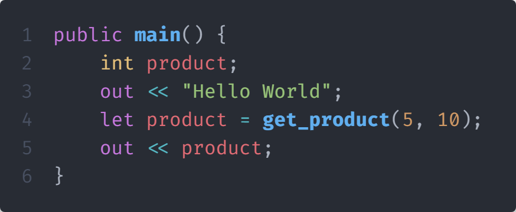

# Differences



## Versace and Python

If you're already a Python developer, Versace should have a gentle learning curve. It is built out of a semi-consistent set of language constructs that should feel familiar and be easy to read and understand.

* In this example we will be create a program that will print the numbers 1 to 10 (each number is the radius) and calculate the area of a circle for each number.
*

    <figure><figcaption>
Pue Python code
</figcaption></figure>



The Python code in the pervious tab would correspond to this Versace code.

<figure><figcaption>
Pure Versace code with explanation.
</figcaption></figure>




Most Python code will natively work in Versace with a little modification, for example let's put a python function into the Versace code and see how it reacts. You can import a python file into Versace without any modifications, but if you want to insert python code into a Versace file you will need to use the `pyc` keyword.


You can't use Versace code in Python.


<figure><figcaption>
Versace code with Python code embedded.
</figcaption></figure>



### Versace and C++

If you're already a C++ developer, Versace should have a somewhat steeper learning curve than coming from python, but it is still fairly easy. It is built out of a semi-consistent set of language constructs that should feel familiar and be easy to read and understand.

* In this example we will be create a program that will print the numbers 1 to 10 (each number is the radius) and calculate the area of a circle for each number.
* We will be using the same code as the Python example.


Versace and C++ are not interoperable.


<figure><figcaption>
Pure C++ code.
</figcaption></figure>


