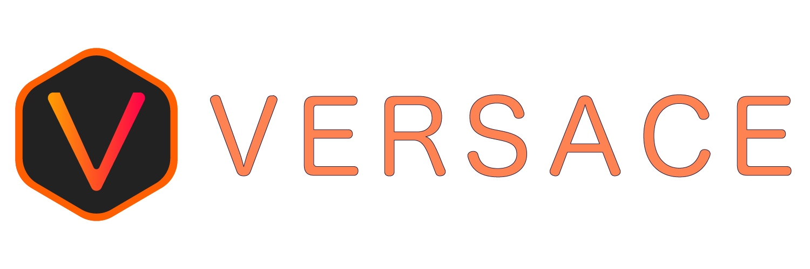

# Introduction

<figure><figcaption>
Logo made in Adobe Illustrator
</figcaption></figure>

## What is Versace?

Versace is a very versatile, fully-fledged <mark style="color:red;">**programing language**</mark>, I have created using Python and C++

In most aspects Versace is better than other readily available languages, for starters, it supports all of python syntax, along with a lot of useful features that come in C++, it also has its own, objects, such as async functions, something both python and C++, can't do without an external library.

Versace also has the ability to transpile code written in Versace to python, or even a binary executable.&#x20;

Versace has excellent runtime speeds (Versace runtime <mark style="color:green;">**0.043s**</mark>, C++ runtime ** **<mark style="color:yellow;">**0.032s**</mark>, Python runtime <mark style="color:red;">**0.076s**</mark>) \* even the compiled versions of your code will run much faster than python, but still a little slower than C++.&#x20;

Best part? - IT DOES NOT NEED ANY COMPILER TO WORK, all it needs is python, and if python is not there don't worry, it will still execute Versace code, you will only lose the ability to compile it to a binary executable.

### What are you <mark style="color:red;">waiting</mark> for <mark style="color:green;">get started</mark> with the[ installation process now!](installation.md)

\*The runtime speed was measured with the same code written in 3 languages, and then run.
