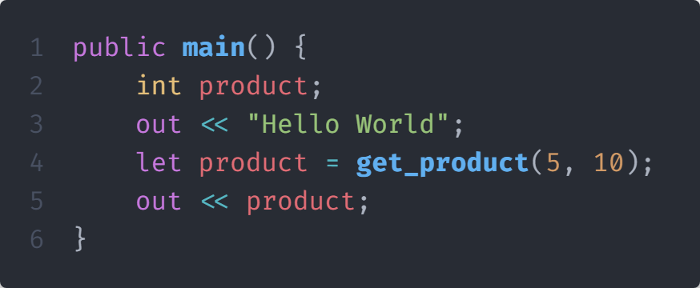

# Versace Header File


You can <mark style="color:red;">**NOT**</mark> use comments in a Versace Header File.


<details>

<summary>What is a Versace Header File?</summary>

A Versace Header file is a file that can contain any number of things, such as a group of imports, or very specific code to execute.

</details>

## Guide for Versace Header Files

If you are planning to make a Versace Header File, please follow these guidelines:

* The file name extension must be `.vh`
* Code must be written i Python
* The top of the file must contain `$<:name:> = [default variable name]` you should replace \[default variable name] with the default variable name you want to use in your code.
  * Example: `$<:name:> = someName`
  * If you include this file in a Versace file without the as keyword, the default variable name (someName) will be used.
* The rest of your file where you will reference the default variable name, you should use `<:name:>`, this will be replaced with the default variable name.
  * Example: `<:name:> = tkinter.Tk()`
  * If you include this file in a Versace file without the as keyword, the default variable name (someName) will be used.
* If you want to use a different variable name, you can use the as keyword in the Versace file.
  * Example: `include "fileName.vh" as [variable name]`
  * If you include this file in a Versace file with the as keyword, the variable name (variable name) will be used.

## Example


```python
$<:name:> = root

import tkinter
from tkinter import ttk
import sv_ttk

<:name:> = tkinter.Tk()
sv_ttk.set_theme("dark")
```



`TkinterUI.vh` is included in the standard library, named and is called`WinUI.vh`



```csharp
include "TkinterUI.vh" as winui; // This will use the variable name winui (instead of root)
include "std.v"; // This is including the standard library (std.v)

public init() { // This is the main function
    str size = f"{get_screen_size()::width - 300}x{get_screen_size()::height - 300}"; // This is getting the screen size and subtracting 300 from the width and height
    let winui::geometry(size); // This is setting the geometry of the window
    usize button = ttk::Button(winui | text="Click me!" | command=winui::quit | width=25); // This is creating a button
    let button::pack(expand=True); // This is packing the button
    let winui::mainloop(); // This is starting the mainloop
} // This is the end of the main function
```


### Output of running the main.v file:

<figure><figcaption><p>Execution of the main.v file</p></figcaption></figure>
